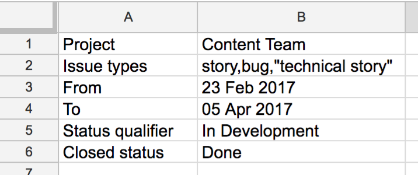

# jira-data-google-script
A test-driven Google script that pulls closed ticket data from Jira into a Google Sheet.

## Overview
This Google script uses a Google Sheet containing two different sheets. Into the first sheet, the script pulls Jira data, and there are various settings in the second sheet.

## Setup
1. Create a new Google Sheet with two sheets. Name the first one "Jira data" and the second one "Settings"
2. In the Settings sheet, input the following values:

| Cell | Value                 | Notes                                                                            |
| ---- | --------------------- | -------------------------------------------------------------------------------- |
| A1   | Project               |                                                                                  |
| B1   | My project            | Use the name of your Jira project here.                                          |
| A2   | Issue types           |                                                                                  |
| B2   | Story,Bug,"Tech task" | Comma-separated list of your project issue types. Wrap multiple words in quotes. |
| C1   | Status qualifier      |                                                                                  |
| C2   | In dev                | The status the ticket must have reached in order to be pulled from Jira.         |
| D1   | Closed status         |                                                                                  |
| D2   | Closed                | The status of a ticket when it is closed.                                        |
| E1   | From                  |                                                                                  |
| E2   | 25 Feb 2017           | The start of the date range.                                                     |
| F1   | To                    |                                                                                  |
| F2   | 28 Feb 2017           | The end of the date range. Note this is inclusive.                               |

It should look something like this:

3. Copy the content of src/jira-data-google-script.js and paste it into the script editor in Tools > Script editor... on the top Google Sheets menu
4. Save the script, close the script editor and return to the sheet
5. Choose Jira > Set credentials... in the top Google Sheets menu and follow the instructions
6. Choose Jira > Refresh data. The script will now pull the Jira information into the Jira data sheet.
7. Add additional sheets that you need for charts etc.
